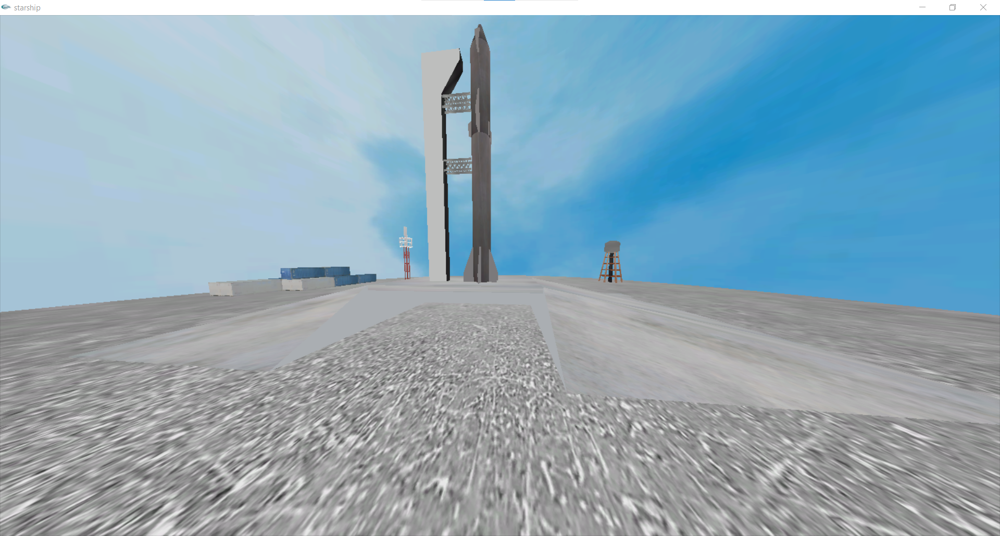

# starship-re
A 3D scene of the Starship and superheavy on the launch pad. This is a clean, refactored and updated version of my other project [starship](https://github.com/kanissh/starship).

<!---->

## Built with
- [OpenGL](https://www.opengl.org/)
- [SOIL2](https://github.com/SpartanJ/SOIL2)

## Getting started
Clone this repository locally. Build and run in Visual Studio.

## SOIL2 setup
This project uses the [SOIL2](https://github.com/SpartanJ/SOIL2) library from [SpartanJ](https://github.com/SpartanJ/). The SOIL2 library is already added in the repo and linked to the project. Refer the original SOIL2 repo to build and compile the library if needed.

## OpenGL setup
OpenGL library is already addded in the repo and linked to the project.

## Screenshots
Screenshots of the scene can be found in the [screenshots](/screenshots) folder.
